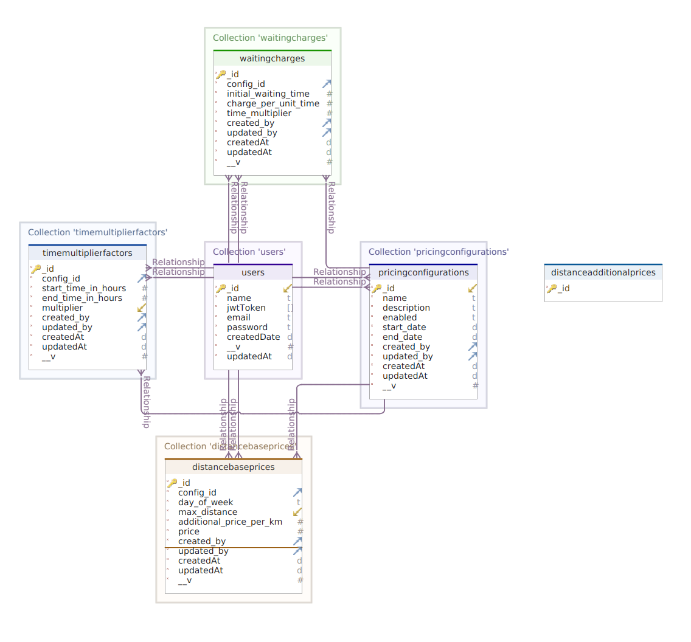

## FYN Pricing Module

In order to setup backend please make sure you have **nodejs** install on your machine, then follow these steps to make server up and running.

- git clone this respository
- run the following command in repo
```
npm install
```
This will install all packages listed in package.json

- then use this commant to run the server
```
npm run start
```
this will start the server in production mode.

** If you are using a windows machine then please replace *export* to *set* under the scripts in package.json **

- Import *fyn_pricing_module.json* file in postman to API collection and try'n'test all apis.


### DB Schema

